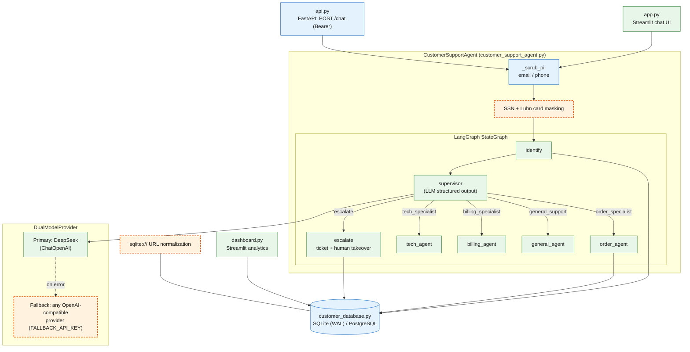

# Nexus Support

> A LangGraph customer-support agent. An LLM supervisor routes each message to order / tech / billing / general specialist nodes. The project also includes PII scrubbing, a FastAPI endpoint, a Streamlit chat UI, and a Streamlit analytics dashboard.

[](https://github.com/Sami123d/nexus-support-extended/actions/workflows/ci.yml)

## Status

- The pytest suite (28 tests, LLM calls mocked) runs green in CI on Python 3.11.
- Running the app needs a DeepSeek API key. It has not been deployed, so there is no live demo and no screenshots.
- As in the original, only the **supervisor routing** calls the LLM (structured output → `RouterDecision`). The specialist nodes return rule-based or templated replies: order lookup from the database, a two-entry tech knowledge base, a fixed billing reply, and a generic greeting. Token counts are a word-count estimate, not real usage. The dashboard adds synthetic rows when fewer than 10 real conversations exist. See [Known issues](#known-issues-inherited-from-the-original).

## What This Project Does

A stateful LangGraph agent that routes customer messages to specialist nodes (order, tech, billing, general). It masks PII in incoming messages before they reach the LLM or the database. When a conversation escalates, it creates a ticket and hands off to a human. It also shows an estimated token/cost figure in the UI and dashboard.

## What Was Changed vs. the Original

### 1. A working dual-provider LLM fallback
The original README advertises "a resiliency pattern that can automatically reroute requests to a secondary LLM provider if the primary experiences latency or outages". But the original `DualModelProvider` just set `self.secondary = self.primary  # Mocking secondary as the same for this environment`, so there was no real fallback. This fork implements one: a separate second provider (OpenAI-compatible, configured with `FALLBACK_API_KEY`/`FALLBACK_MODEL`/`FALLBACK_API_BASE`) that is called only when the primary call raises. This covers both plain `invoke` and `with_structured_output`. If no fallback key is configured, the provider logs that fallback is disabled and re-raises the original error, instead of silently pretending to have redundancy it doesn't have.

### 2. A real bug fix: the API service never actually started in Docker
Both the `Dockerfile` `CMD` and `docker-compose.yml` ran `python api.py`. But `api.py` only defined the FastAPI `app` object and never called `uvicorn.run()`, so running it directly did nothing and exited. The containerized API never came up. This fork adds a proper `if __name__ == "__main__": uvicorn.run(...)` entry point. It also fixes the Dockerfile/compose commands and the exposed port to match what the README documents (`8001`).

### 3. Removed a hardcoded default secret
`api.py` fell back to `API_KEY = os.getenv("API_KEY", "agentic_secret_key_2026")`. That put a real default bearer token in the source code, usable by anyone who read the repo if a deployer forgot to override it. This fork removes the default, and the API now refuses to start if `API_KEY` isn't explicitly set.

### 4. Fixed a Windows-breaking database bug
The documented `.env` default, `DATABASE_URL=sqlite:///customers.db`, was passed directly to `sqlite3.connect()`, which doesn't understand SQLAlchemy-style URLs. On Windows this fails outright, because `:` isn't a valid filename character. This fork converts `sqlite://` and `sqlite:///` URLs to a plain path before connecting.

### 5. Expanded PII scrubbing
`_scrub_pii` was documented as covering "Email/Phone/SSN masking" and "Sensitive Identifiers" in general, but the code only masked email and phone. This fork adds SSN masking and credit card number masking. Card numbers are checked with the Luhn algorithm, so long digit strings such as order or ticket numbers aren't wrongly flagged as card numbers.

### 6. Test suite (`tests/`)
The original had no tests, even though `pytest` was listed as a dependency. This fork adds 28 tests covering:
- PII scrubbing
- the dual-provider fallback logic, including the "no fallback configured" path
- the database layer, including the sqlite URL fix
- each LangGraph node function: identify, supervisor routing, the order/tech/billing/general specialists, and escalation

## My contributions

The extension work was imported as **one squashed commit** ([`98c7528`](https://github.com/Sami123d/nexus-support-extended/commit/98c7528103df9ab0db41d9098669050f368a89fe)), so there is no separate commit for each change. The table links to the files that implement each change.

| Change | Files | Commit |
|---|---|---|
| Real dual-provider LLM fallback | [`customer_support_agent.py`](customer_support_agent.py) (`DualModelProvider`), [`.env.example`](.env.example) | squashed in [`98c7528`](https://github.com/Sami123d/nexus-support-extended/commit/98c7528103df9ab0db41d9098669050f368a89fe) |
| Docker startup fix (uvicorn entry point, port 8001) | [`api.py`](api.py), [`Dockerfile`](Dockerfile), [`docker-compose.yml`](docker-compose.yml) | squashed in [`98c7528`](https://github.com/Sami123d/nexus-support-extended/commit/98c7528103df9ab0db41d9098669050f368a89fe) |
| Removed hardcoded default API key | [`api.py`](api.py) | squashed in [`98c7528`](https://github.com/Sami123d/nexus-support-extended/commit/98c7528103df9ab0db41d9098669050f368a89fe) |
| SQLite URL normalization | [`customer_database.py`](customer_database.py) | squashed in [`98c7528`](https://github.com/Sami123d/nexus-support-extended/commit/98c7528103df9ab0db41d9098669050f368a89fe) |
| SSN + Luhn-checked card masking | [`customer_support_agent.py`](customer_support_agent.py) (`_scrub_pii`, `_mask_if_card`) | squashed in [`98c7528`](https://github.com/Sami123d/nexus-support-extended/commit/98c7528103df9ab0db41d9098669050f368a89fe) |
| pytest suite | [`tests/`](tests), [`pytest.ini`](pytest.ini) | squashed in [`98c7528`](https://github.com/Sami123d/nexus-support-extended/commit/98c7528103df9ab0db41d9098669050f368a89fe) |
| GitHub Actions CI | [`.github/workflows/ci.yml`](.github/workflows/ci.yml) | [`525b7cf`](https://github.com/Sami123d/nexus-support-extended/commit/525b7cf08bc524fbb734d7b56cb115d2ec16aafc) |

## Architecture

Green nodes (solid border) are from the original project. Orange nodes (dashed border) were added in this fork. Blue nodes are original but were modified in this fork.



**Legend:** green = original (Sami Ahmed), blue = original but modified here (`api.py`: no default key and a uvicorn entry point; `_scrub_pii` extended; database path handling), orange dashed = added in this fork.

## Tech Stack

Python, LangGraph, LangChain (`langchain-openai`), DeepSeek (primary LLM) + any OpenAI-compatible provider (fallback, new), Streamlit, Plotly, FastAPI, SQLite/PostgreSQL, pytest, GitHub Actions.

## Installation & Setup

```bash
git clone https://github.com/Sami123d/nexus-support-extended.git
cd nexus-support-extended
pip install -r requirements.txt
cp .env.example .env
```

### Environment variables

| Name | Required | Purpose |
|---|---|---|
| `DEEPSEEK_API_KEY` | yes | Primary LLM (DeepSeek, OpenAI-compatible endpoint) |
| `PRIMARY_MODEL` | no | Primary model name (default `deepseek-chat`) |
| `FALLBACK_API_KEY` | no | Enables the fallback provider |
| `FALLBACK_MODEL` | no | Fallback model name (default `gpt-4o-mini`) |
| `FALLBACK_API_BASE` | no | Fallback base URL (default: official OpenAI endpoint) |
| `API_KEY` | yes (for `api.py`) | Bearer token for the FastAPI service. There is no default |
| `DATABASE_URL` | no | SQLite path / `sqlite:///` URL, or a `postgres://` URL |
| `LOG_LEVEL` | no | Logging level |

### Run

```bash
python -m uvicorn api:app --host 0.0.0.0 --port 8001
python -m streamlit run app.py
```

Analytics dashboard:

```bash
python -m streamlit run dashboard.py
```

### Docker

```bash
docker compose up --build
```

- API: `http://localhost:8001`
- UI: `http://localhost:8503`

## API Reference (`api.py`)

| Method | Path | Auth | Purpose |
|---|---|---|---|
| GET | `/` | none | Redirects to `/docs` (Swagger UI) |
| POST | `/chat` | `Authorization: Bearer $API_KEY` | Send `{message, state?}`. Returns the reply, the updated graph state, and analytics (estimated tokens/cost, active specialist, human-takeover flag) |
| GET | `/health` | none | Static health payload |

## Testing

```bash
pytest
```

CI runs the suite on every push to `main` with dummy keys ([workflow](.github/workflows/ci.yml)). LLM calls are mocked, so no real API is called.

## Known issues (inherited from the original)

These exist in the original code and have **not** been fixed in this fork yet:

- **Customer identification after scrubbing:** `send_message` masks emails *before* the graph runs, so the `identify` node sees `[EMAIL_MASKED]` and cannot look up the customer from a chat message. The unit test for `identify` calls the node directly, which bypasses this.
- **Billing escalation doesn't happen:** `billing_agent` sets `active_agent="escalate"` for refund/charge/dispute messages. But the graph has a fixed edge `billing_agent → END`, so the turn ends without a reply and without escalating.
- Token and cost figures are estimates based on word count. The dashboard adds synthetic sample rows when fewer than 10 conversations are stored.

## License

MIT License. See [LICENSE](LICENSE). Original work by Sami Ahmed. Modifications in this repository are released under the same license.

## Attribution

- **Original project and architecture:** [Ismail Sajid](https://github.com/Ismail-2001), [Customer-Support-Agent-](https://github.com/Ismail-2001/Customer-Support-Agent-)
- **Extended by:** [Sami123d](https://github.com/Sami123d)
